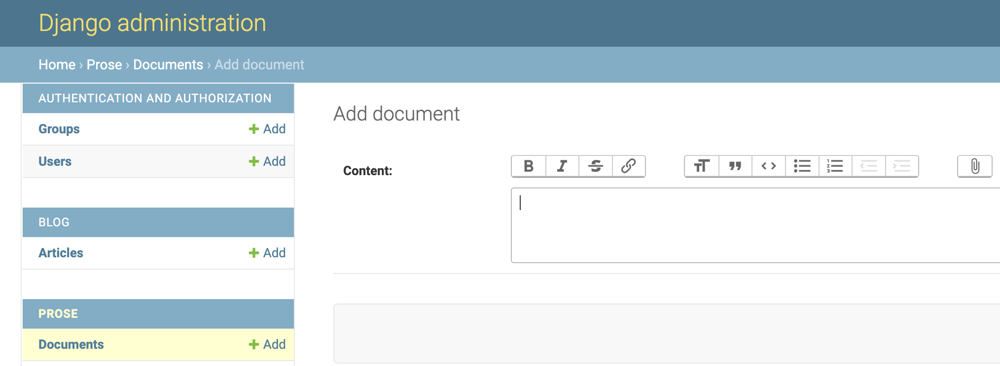

# Django Prose

Django Prose provides your Django applications with wonderful rich-text editing.



## Requirements

- Python 3.6.2 or later
- Django 3.0 or later

## Getting started

To get started with Django Prose, first make sure to install it. We use and suggest using Poetry, although Pipenv and pip will work seamlessly as well

```console
poetry add django-prose
```

Then, add `prose` in Django's installed apps (example: [`prose_example/prose_example/settings.py`](https://github.com/withlogicco/django-prose/blob/55fb9319e55d873afe43968817a2f5ea3f055d11/prose_example/prose_example/settings.py#L46)):

```python
INSTALLED_APPS = [
    # Django stock apps (e.g. 'django.contrib.admin')

    'prose',

    # your application's apps
]
```

Last, run migrations so you can use Django Prose's Document model.

## Usage

There are different ways to use Django prose according to your needs. We will examine all of them here.

### Small rich-text information

You might want to add rich-text information in a model that is just a few characters (e.g. 140), like an excerpt from an article. In that case we suggest using the `RichTextField`. Example:

```py
from django.db import models
from prose.fields import RichTextField

class Article(models.Model):
    excerpt = RichTextField()
```

### Large rich-text information

In case you want to store large rich-text information, like the content of an article, which can span to quite a few thousand characters, we suggest you use the `AbstractDocument` model. This will save large rich-text information in a separate database table, which is better for performance. Example:

```py
from django.db import models
from prose.fields import RichTextField
from prose.models import AbstractDocument

class ArticleContent(AbstractDocument):
    pass

class Article(models.Model):
    excerpt = RichTextField()
    body = models.OneToOneField(ArticleContent, on_delete=models.CASCADE)
```


## Development for Django Prose

All development tooling for Django Prose has been set up with Docker. To get started run these commands in the provided order:

```console
docker compose run --rm migrate
docker compose run --rm createsuperuser
docker compose up
```

---

<p align="center">
  <i>🦄 Built with ❤️ by <a href="https://withlogic.co/">LOGIC</a>. 🦄</i>
</p>
